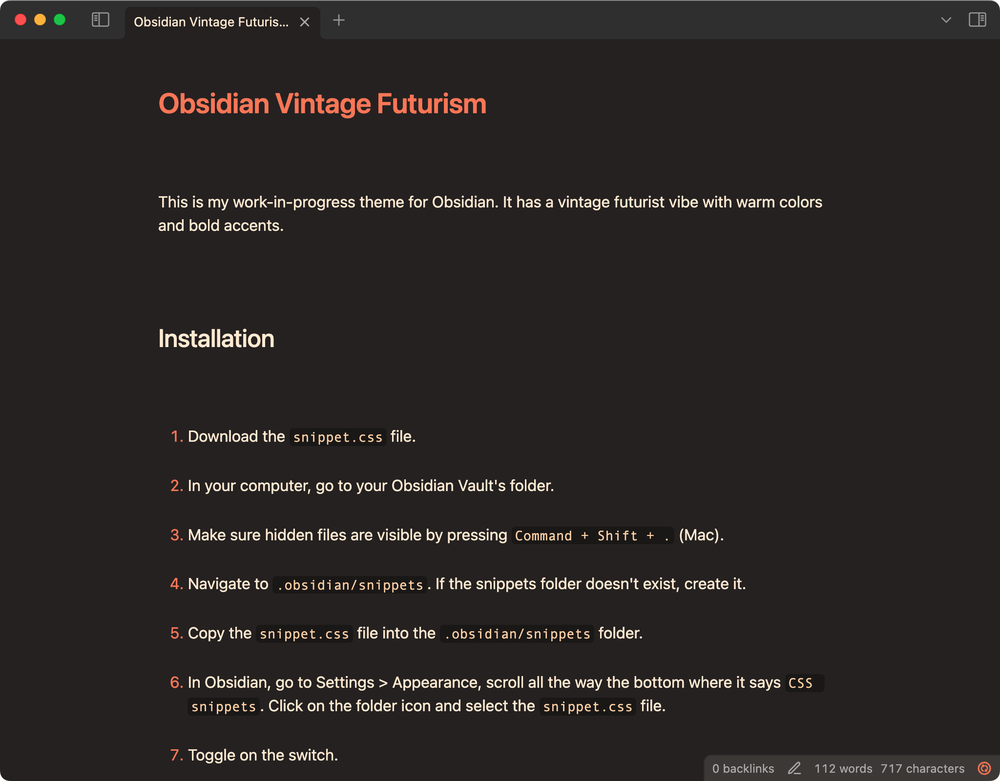

# Obsidian Vintage Futurism

This is my work-in-progress theme for Obsidian. It has a vintage futurist vibe with warm colors and bold accents.

## Installation

1. Download the `snippet.css` file.
2. In your computer, go to your Obsidian Vault's folder.
3. Make sure hidden files are visible by pressing `Command + Shift + .` (Mac).
4. Navigate to `.obsidian/snippets`. If the snippets folder doesn't exist, create it.
5. Copy the `snippet.css` file into the `.obsidian/snippets` folder.
6. In Obsidian, go to Settings > Appearance, scroll all the way the bottom where it says `CSS snippets`. Click on the folder icon and select the `snippet.css` file.
7. Toggle on the switch.
8. Restart Obsidian.

# Preview

